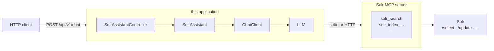

# Solr MCP Client

A Spring Boot REST service that puts a stable HTTP contract in front of a chat model wired to
[Apache Solr MCP](https://github.com/apache/solr-mcp). It is an **MCP client**: it connects to a
separate Solr MCP server, attaches that server's tools to a Spring AI `ChatClient`, and exposes the
resulting assistant over a small JSON API — so a user interface does not have to embed Spring AI, an
MCP SDK, or a model provider's credentials.



**Profiles select how this client *reaches* the Solr MCP server, never how it serves its own API** —
which is why they are all prefixed `mcp-`. It is the same REST service on the same port in every
profile.

| | |
| --- | --- |
| Java toolchain | 25 |
| Spring Boot | 4.1.1 |
| Spring AI | 2.0.1 |
| springdoc-openapi | 3.1.0 |
| Build | Gradle (Kotlin DSL) + version catalog |
| HTTP port | **9090** (`server.port`) |
| License | Apache-2.0 |

---

## Documentation

| Guide | Covers |
| --- | --- |
| [REST API](docs/rest-api.md) | Endpoints, the conversation header, RFC 9457 errors, API versioning, CORS, OpenAPI/Swagger UI |
| [Transports](docs/transports.md) | The three `mcp-*` profiles, Keycloak/OAuth2 service-token setup, the audience claim, startup verification |
| [Model providers](docs/model-providers.md) | How the provider is chosen, OpenAI/Anthropic keys, OpenAI-compatible endpoints, local models, the tool-calling constraint |
| [Observability](docs/observability.md) | Traces, logs and metrics over OTLP, the gRPC-only-collector caveat, trace propagation into MCP calls |
| [Logging the LLM exchange](docs/logging.md) | Seeing the full tool negotiation with `SimpleLoggerAdvisor` |
| [Security posture](docs/security.md) | Why inbound is unauthenticated, what OAuth2 actually secures, secrets and error leakage |
| [Architecture](docs/architecture.md) | Package layout and the seam a future UI binds to |
| [Framework comparison](docs/framework-comparison.md) | MCP feature parity vs JVM (LangChain4j, Koog, Embabel) and Python (LangGraph, OpenAI Agents SDK, PydanticAI, Google ADK, CrewAI) frameworks |

[AGENTS.md](AGENTS.md) holds the wiring rules and conventions this codebase holds itself to.

---

## Requirements

- **JDK 25** (the Gradle toolchain will resolve one if it is not the default JDK).
- **An API key for the chat model provider on the classpath.** Out of the box that is OpenAI, so
  `OPENAI_API_KEY`. See [Model providers](docs/model-providers.md) to change it.
  Note the application starts *without* a key and fails on the first chat request instead.
- **A reachable Solr MCP server**, in one of the three shapes described in
  [Transports](docs/transports.md). The application refuses to start if it cannot list any tools
  from one.
- Docker, for the `mcp-stdio-docker` profile only.

---

## Quick start

The default profile is `mcp-stdio` (`spring.profiles.default`), which launches a local Solr MCP
server jar as a child process:

```bash
export OPENAI_API_KEY=sk-...
export SOLR_MCP_JAR=/absolute/path/to/solr-mcp.jar   # must be absolute
export SOLR_URL=http://localhost:8983/solr/

./gradlew bootRun
```

Then:

```bash
curl -si localhost:9090/api/v1/chat \
  -H 'Content-Type: application/json' \
  -d '{"message":"How many documents are in the books collection?"}'
```

Or open Swagger UI at <http://localhost:9090/swagger-ui.html>.

---

## Build and run

```bash
./gradlew build                 # compile + test + 80% instruction coverage gate
./gradlew bootRun               # run with the default profile (mcp-stdio)

# pick a different outbound transport
./gradlew bootRun --args='--spring.profiles.active=mcp-stdio-docker'
./gradlew bootRun --args='--spring.profiles.active=mcp-http'

# or run the packaged jar
./gradlew bootJar
java -jar build/libs/solr-mcp-client-0.0.1-SNAPSHOT.jar
java -jar build/libs/solr-mcp-client-0.0.1-SNAPSHOT.jar --spring.profiles.active=mcp-http
```

`mcp-stdio` is a **default** profile, not an active one: naming any profile explicitly *replaces*
it. There is no "no transport" fallback — see
[Startup verification](docs/transports.md#startup-verification).

---

## REST API at a glance

| Method | Path | Purpose |
| --- | --- | --- |
| `POST` | `/api/v1/chat` | Ask the assistant a question |
| `DELETE` | `/api/v1/chat/{conversationId}` | Release a conversation's retained turns |
| `GET` | `/api-docs` | OpenAPI 3 document |
| `GET` | `/swagger-ui.html` | Swagger UI |
| `GET` | `/actuator/health`, `/actuator/info` | The only exposed actuator endpoints |

The conversation is carried in the `X-AI-Conversation-Id` header in both directions; omit it to
start a new conversation. Errors are RFC 9457 `application/problem+json`, and the API version is a
path segment (`v1` by default) resolved by Spring Framework 7's built-in API versioning. The
[REST API guide](docs/rest-api.md) has the full contract, including the versioning gotchas and CORS.

---

## Build and test

```bash
./gradlew build     # compiles, tests, and enforces 80% instruction coverage
./gradlew test
./gradlew sonar     # SonarCloud analysis
```

Gradle is the only build system; the Maven build was removed. Dependency versions live in
`gradle/libs.versions.toml` — add dependencies there, not inline. CycloneDX produces an SBOM during
packaging; JaCoCo enforces coverage (excluding the application class) and feeds SonarCloud.

Tests never require a live Solr, MCP server, model account or identity provider: context tests set
`spring.ai.mcp.client.initialized=false` so transports bind without launching a child process or
opening a connection — replacing `McpToolVerifier` with `@MockitoBean`, since verifying would open
that connection anyway — and web slice tests pin `spring.ai.model.chat` so they do not depend on
which API keys a developer happens to have exported.

---

## License

Licensed under the [Apache License, Version 2.0](LICENSE).

| File | Purpose |
|------|---------|
| [`LICENSE`](LICENSE) | The full Apache-2.0 text, verbatim. |
| [`NOTICE`](NOTICE) | Required attribution, propagated to everything that redistributes this code. |

Every source file carries the standard ASF header, and both files are packaged into `META-INF/` of
each jar the build produces — the executable jar and the `-plain` jar alike:

```kotlin
tasks.withType<Jar>().configureEach {
    metaInf {
        from(layout.projectDirectory.file("LICENSE"))
        from(layout.projectDirectory.file("NOTICE"))
    }
}
```

The rule is applied to every `Jar` task rather than to `bootJar` alone, so the plain jar — and any
sources or javadoc jar added later — cannot ship without them. It copies the repository-root files
rather than holding a second copy, so the two cannot drift.

`NOTICE` is deliberately minimal. It carries only legally required attribution, not a dependency
inventory: everything in it propagates downstream to every consumer, so entries that are not
required are a defect rather than good manners. No dependency here is vendored into the source
tree, and Gradle-resolved dependencies do not earn an entry on their own — so if you add one, check
whether its licence actually obliges you before writing anything in this file.
