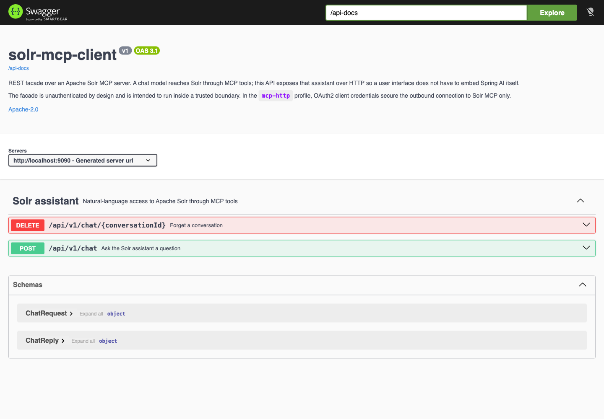
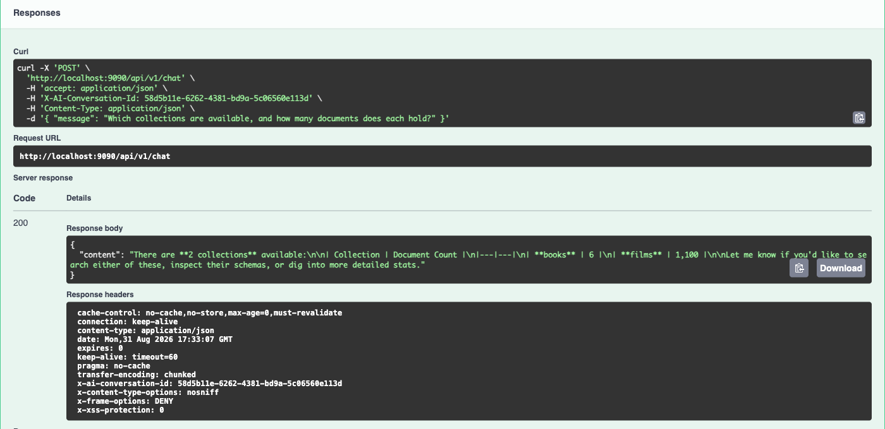

# REST API

[← back to the README](../README.md)

| Method | Path | Purpose |
| --- | --- | --- |
| `POST` | `/api/v1/chat` | Ask the assistant a question |
| `DELETE` | `/api/v1/chat/{conversationId}` | Release a conversation's retained turns |
| `GET` | `/api-docs` | OpenAPI 3 document |
| `GET` | `/swagger-ui.html` | Swagger UI |
| `GET` | `/actuator/health`, `/actuator/info` | The only exposed actuator endpoints |

## `POST /api/v1/chat`

**Request** — `application/json`:

```json
{ "message": "How many documents are in the books collection?" }
```

`message` must be non-blank.

**Response** — `200 application/json`:

```json
{ "content": "The books collection contains 12,438 documents." }
```

The conversation id travels **only** in the `X-AI-Conversation-Id` header, in both directions —
never in the body. Omit it on the request to start a new conversation; the id used is always echoed
on the response.

```bash
curl -si localhost:9090/api/v1/chat \
  -H 'Content-Type: application/json' \
  -H 'X-AI-Conversation-Id: user-7:session-4' \
  -d '{"message":"Now show me the five newest ones."}'
```

There is deliberately no shared default conversation id: this facade performs no inbound
authentication, so a fixed fallback would drop unrelated callers into one memory bucket where they
could read each other's turns. A conversation id is a routing key, not a secret — any caller that
knows one can continue it.

## `DELETE /api/v1/chat/{conversationId}`

Returns `204 No Content`. Chat memory is Spring AI's in-process `MessageWindowChatMemory`: it is
lost on restart and is never evicted on its own, so long-lived deployments should release
conversations when a session ends. For durable history, add
`spring-ai-starter-model-chat-memory-repository-jdbc`.

## Errors

Failures are RFC 9457 `application/problem+json`:

| Status | When |
| --- | --- |
| `400` | Request validation failed, or the API version segment is unsupported/unparseable |
| `404` | No handler — including `/api/chat` with the version segment omitted |
| `502` | The chat model, the MCP server, or the token endpoint rejected the request |
| `504` | An upstream I/O timeout, or a transport that dropped mid-call |

`502`/`504` carry a **generic** `detail` and the cause is logged server-side only: provider messages
routinely embed endpoint URLs and payloads that must not reach an API caller.

## Versioning

The version is a first-class mapping dimension using Spring Framework 7's framework-owned API
versioning, not a hand-written path prefix. Handlers declare `version = "v1"`; the resolver takes
**path segment 1**:

```yaml
spring:
  mvc:
    apiversion:
      use:
        path-segment: 1
      required: false
      default: "v1"
      detect-supported: true
```

| Request | Result |
| --- | --- |
| `/api/v1/chat`, `/api/1/chat`, `/api/1.0/chat`, `/api/1.0.0/chat` | `200` — versions are compared semantically, so all four are the same version |
| `/api/v9/chat` | `400` — unsupported version, named as such |
| `/api/banana/chat` | `400` — unparseable version |
| `/api/chat` | **`404`** — see the gotcha below |

> **Gotcha: `v1` being the *default version* does not make the segment optional.** The version
> segment is part of the URL template (`@RequestMapping("/api/{version}")`), so `/api/chat` never
> reaches a handler at all — it is a 404, not a 400 about the version. `spring.mvc.apiversion.default`
> fires only when the resolver returns `null`, and a path-segment resolver returns whatever sits at
> that index. Serving unversioned URLs would require mapping the controller at both `/api` and
> `/api/{version}` plus an `ApiVersionResolver` bean using `PathApiVersionResolver`'s predicate
> constructor, which Spring Boot does not expose as a property.
>
> `required` must be `false` here: Spring refuses to start with `required: true` and a default
> configured together.

Adding v2 later means adding handlers with `version = "2.0"` — no new controller path, no routing
changes. `version = "1.0+"` carries a handler forward to later versions.

## Cross-origin clients

Cross-origin access is **off** until you name the origins; the intended deployment is same-origin.

```bash
export SOLR_MCP_CLIENT_CORS_ALLOWED_ORIGINS=https://solr-ui.example.com
# or several: https://solr-ui.example.com,https://admin.example.com
```

That maps to `solr.mcp.client.cors.allowed-origins`. When it is set, `ApiCorsConfiguration`
registers a mapping on `/api/**` allowing `GET`, `POST`, `DELETE`, any request header, and — this is
the part that matters — puts `X-AI-Conversation-Id` in `Access-Control-Expose-Headers`. A browser
cannot read a response header cross-origin otherwise, so a UI on another origin would silently see
no id and start a fresh conversation on every request, with no error to notice.

Origins are stated explicitly on purpose: an unqualified `addMapping` allows *every* origin, which
matters especially here because the facade has no inbound authentication.

## OpenAPI

- Document: <http://localhost:9090/api-docs>
- Swagger UI: <http://localhost:9090/swagger-ui.html>

Bean Validation constraints on the request model are emitted into the schema, so generated clients
see the same limits the server enforces. **No security scheme is declared**, because none is
enforced — advertising one would misrepresent the contract.

The endpoints as Swagger UI presents them:



And a live `POST /api/v1/chat` executed from Swagger UI — note the `X-AI-Conversation-Id` response
header carrying the id to continue the conversation with:


